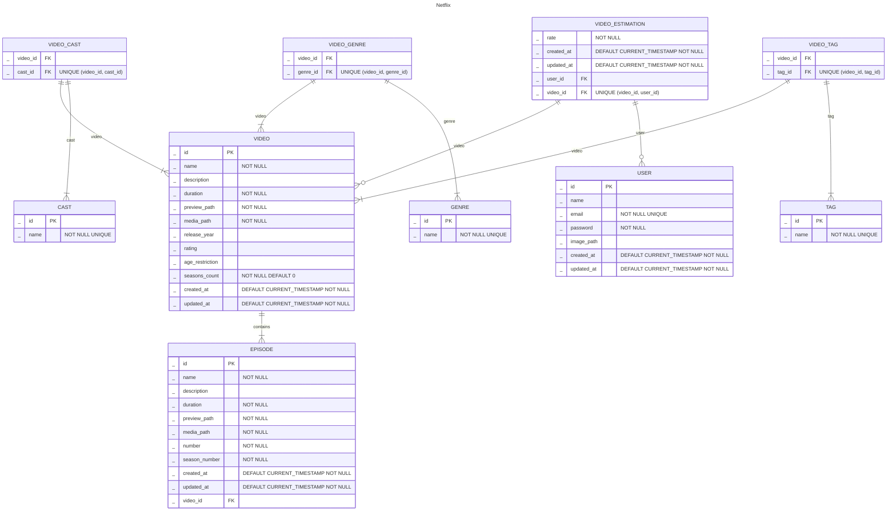

# 2023_2_Holi

## Объяснение нормальных форм(нф):

- 1я нф - т.к. каждый столбец содержит в себе атомарное значение
- 2я нф -  т.к. нет составных ключей
- 3я нф - т.к. каждый столбец таблицы зависит только от PK (нет зависимостей между неключевыми атрибутами)
- НФБК - т.к. нет составных потенциальных ключей

## Функциональные зависимости

Relation VIDEO:

{id} -> name, description, duration, preview_path, media_path, release_path, rating, age_restriction, seasons_count

Relation EPISODE:

{id} -> name, description, duration, preview_path, number

Relation USER:

{id} -> name, email, password, date_joined, image_path, created_at

Relation CAST:

{id} -> name

Relation TAG:

{id} -> name

Relation GENRE:

{id} -> name

Relation VIDEO_ESTIMATION:

{user_id, video_id} -> rate

## ER

